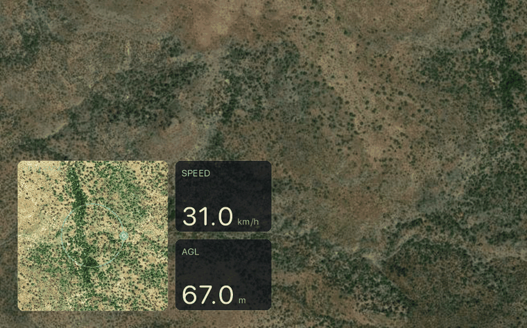

# DroneTrace

**Turn DJI drone footage into a moving-map + speed + altitude overlay — with *true* above-ground-level altitude.**

DroneTrace reads the telemetry DJI hides inside each `.MP4` and renders a clean,
transparent HUD you drop onto a track in any video editor: a satellite mini-map
tracing your flight path, a live speed readout, and a true above-ground-level
altitude readout.



<sub>Demo: a synthetic flight over Arizona desert — moving satellite mini-map, live speed, and true above-ground-level altitude.</sub>

---

## Features

- 🛰️ **Moving satellite mini-map** with the smoothed GPS track + live position dot
- 🚀 **Speed** (km/h, mph, or m/s) and **altitude** readouts
- ⛰️ **True AGL / ASL altitude** from an SRTM terrain model + recovered home point
- 🎯 **Home-point trilateration** from DJI's distance-from-home data — works even
  when the clip never shows the takeoff
- 〰️ **Smoothing + Catmull-Rom spline** to fix DJI's coarse (4-decimal) GPS into a
  flowing path
- 🎬 **ProRes 4444 + alpha** output, panel-cropped by default (≈4× faster than
  full-frame)
- 📁 **Batch a whole folder** with one shared, pooled home point per session
- 🌐 Works offline too (plain map panel, relative altitude) — degrades gracefully

## Requirements

- **ffmpeg** and **ffprobe** on your `PATH` ([ffmpeg.org](https://ffmpeg.org) /
  `brew install ffmpeg`)
- **Python 3.9+** with **Pillow** and **numpy**
- Internet for satellite tiles and the elevation lookup (both cached locally;
  optional — see graceful-degradation note above)

## Install

```bash
git clone https://github.com/mihasm/dronetrace.git
cd dronetrace
pip install -r requirements.txt        # Pillow + numpy
# optional: install the `dronetrace` command
pip install .
```

Or just run the single file directly: `python3 dronetrace.py ...`

## Usage

```bash
# one clip -> CLIP.overlay.mov next to it
dronetrace flight.MP4

# preview a single frame (no video render) to check the look fast
dronetrace flight.MP4 --still 12          # -> flight.preview.png at t=12s

# composite the HUD with the footage into a finished video
dronetrace flight.MP4 --composite     # -> flight.hud.mp4  (or set -o yourname.mp4)

# whole folder, one shared home point for the session
dronetrace /path/to/clips --batch

# quick low-res draft
dronetrace flight.MP4 --fast
```

### Options

| Flag | Default | Description |
|------|---------|-------------|
| `--alt agl\|asl\|rel` | `agl` | Altitude shown: above-ground-level, above-sea-level, or raw height-above-takeoff |
| `--units kmh\|mph\|ms` | `kmh` | Speed units |
| `--tiles sat\|osm` | `sat` | Map background: satellite (Esri) or street map (OSM) |
| `--smooth N` | `9` | GPS smoothing window (samples ≈ seconds); `0` disables |
| `--composite` | off | Composite the HUD with the footage into a finished H.264 file `<clip>.hud.mp4` (no editor needed) |
| `--gpu` | off | Use Apple-Silicon hardware encoders (VideoToolbox) — ~5× faster encode |
| `--full` | off | Render at full video resolution (auto-aligns, no positioning) instead of panel-only |
| `--fast` / `--scale F` | `1.0` | Render at half / arbitrary resolution scale |
| `--home LAT,LON` | auto | Override the home point (otherwise trilaterated) |
| `--still T` | — | Render one preview PNG at time `T` instead of a video |
| `--start S` / `--seconds N` | — | Render only a slice (handy for tests) |
| `-o FILE` | auto | Output path |

## Performance

Frame drawing (Pillow) and video encoding both run on the CPU by default. On
**Apple Silicon**, add `--gpu` to encode on the media engine (VideoToolbox):
H.264 for `--composite`, ProRes 4444 (with alpha) for overlays. In testing on an
M2, an 8-second 4K composite went from **~33 s to ~6.5 s** (~5× faster). The
panel-only default (vs `--full`) also avoids rendering a mostly-empty frame.

## How it works

1. **Extract** the telemetry subtitle stream with ffmpeg (`-map 0:s:0 -f srt`).
2. **Parse** per-second GPS, height (`H`), horizontal/vertical speed, and
   distance-from-home (`D`).
3. **Recover the home point** by trilateration: home is the point that lies
   distance `Dᵢ` from every `GPSᵢ` (linear least-squares). In `--batch`, all
   clips in the folder are pooled into one home so hovering clips inherit the
   right baseline.
4. **Altitude** = `home_ground_elevation + H` (ASL), or minus the terrain under
   the drone (AGL), using the [OpenTopoData](https://www.opentopodata.org)
   SRTM-30m model. Cached to `.elevation_cache.json`.
5. **Smooth** the coarse 4-decimal GPS (moving average) and fit a **Catmull-Rom
   spline** for a flowing path and dot motion.
6. **Render** each frame with Pillow over a satellite-tile mini-map and stream
   raw RGBA into ffmpeg → **ProRes 4444** (`yuva444p10le`, real alpha).

## Supported drones & data

Built and tested with the **DJI Mini 3** (model `FC3682`). It should work with
any DJI that embeds the standard telemetry subtitle (GPS, `H`, `H.S`, `V.S`,
`D`). Per-second fields are: GPS lat/lon, height, horizontal & vertical speed,
distance-from-home, and camera settings (ISO/shutter/EV).

### Known limitations

- **GPS is logged at ~4 decimals (~10 m)** — DroneTrace smooths/splines it, but
  it can't add precision that was never recorded.
- **No per-frame attitude.** Pitch/roll/yaw are only stored as a *single
  snapshot* per file, so a live artificial-horizon/compass can't be driven from
  the video (that data lives only in the DJI Fly app flight logs).
- **AGL accuracy** is bounded by SRTM-30m resolution and the GPS precision —
  great for broad terrain (valleys, hills), not for treetop/building clearance.

## Credits & attribution

- Satellite tiles: **Esri World Imagery** — © Esri and its data providers.
- Street tiles: **© OpenStreetMap contributors**.
- Elevation: **OpenTopoData** serving **NASA SRTM** data.

Please respect each provider's usage policy; this tool is intended for personal
/ low-volume use.

## License

MIT — see [LICENSE](LICENSE).
